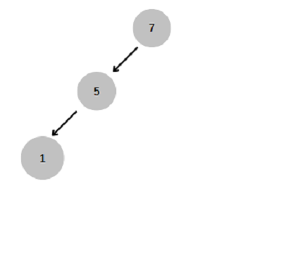

# Binary Search Tree Projesi
## Soru
**[7, 5, 1, 8, 3, 6, 0, 9, 4, 2]** dizisinin Binary-Search-Tree aşamalarını yazınız.Örnek: root x'dir. root'un sağından y bulunur. Solunda z bulunur vb.

## Cevap
**[7, 5, 1, 8, 3, 6, 0, 9, 4, 2]** dizisinde;
*   Root node **7**'dir
*   Root’tan(7) küçük değere sahip olan node’lar Root’un sol tarafında yer alır.
*   Root’tan(7) büyük değere sahip olan node’lar Root’un sağ tarafında yer alır.

1.  Root elemanı olan 7'yi yerleştirdik.

2.  5, 7'den küçük olduğu için 7'nin soluna yerleştirdik.

3.  1,7 ve 5'den küçük olduğu için 5'in soluna yerleştirdik.

4.  8, 7'den büyük olduğu için 7'nin sağına yerleştirdik.

5.  3,7 ve 5'den küçük fakat 1'den büyük olduğu için 1'in sağına yerleştirdik.

6.  6,7'den küçük fakat 5'den büyük olduğu için 5'in sağına yerleştirdik.

7.  0,7 ve 1'den küçük olduğu için 1'in soluna yerleştirdik.

8.  9,7 ve 8'den büyük oludğu için 8'in sağına yerleştirdik.

9.  4,7 ve 5'den küçük fakat 1 ve 3'den büyük olduğu için 3'ün sağına yerleştirdik.

10. 2,1'den büyük fakat 7 ve 3'den küçük olduğu için 3'ün soluna yerleştirdik.

**Ödev linki:** https://app.patika.dev/courses/veri-yapilari-ve-algoritmalar/binary-search-tree-proje

------------

